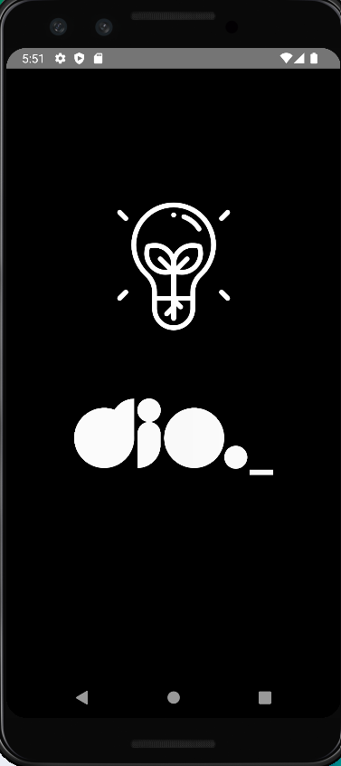

# dio-flashlight

**Desafio DIO:** Construindo um App usando Sensor de Movimento com React Native

## Conteúdo

- Libs react-native-shake e react-native-torch
- icons: https://drive.google.com/drive/folders/1Kuh5tysH7-UFuSLHX0IQIIh2xcghHUIX
- StyleSheet
- Hook useState
- Add Listener to RNShake
- Lifecicly ReactJS

[Abaixe o APK](https://github.com/TiagoMerc/dio-flashlight/releases/tag/1.0.0)